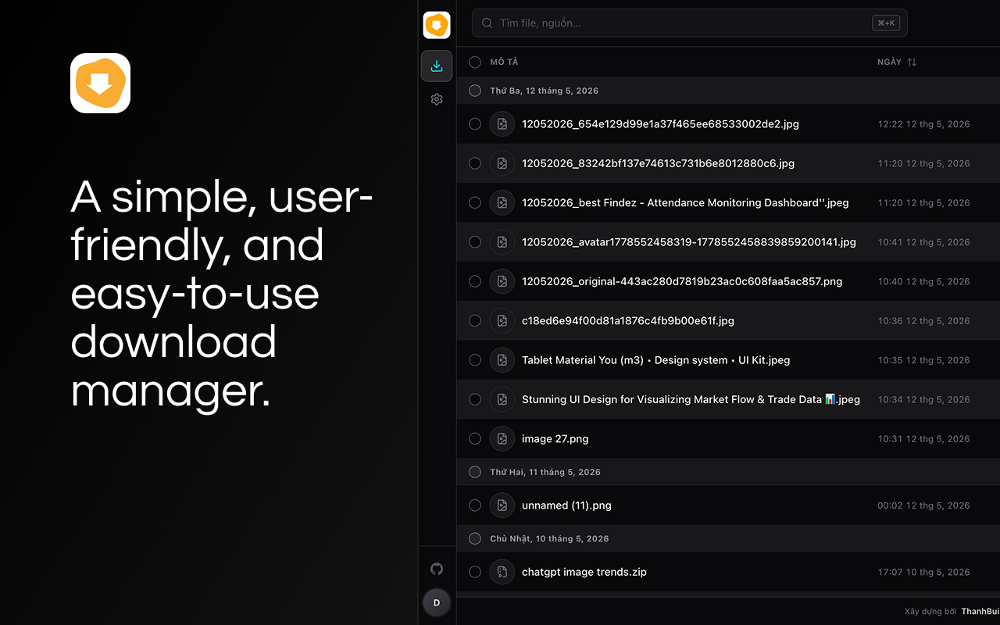
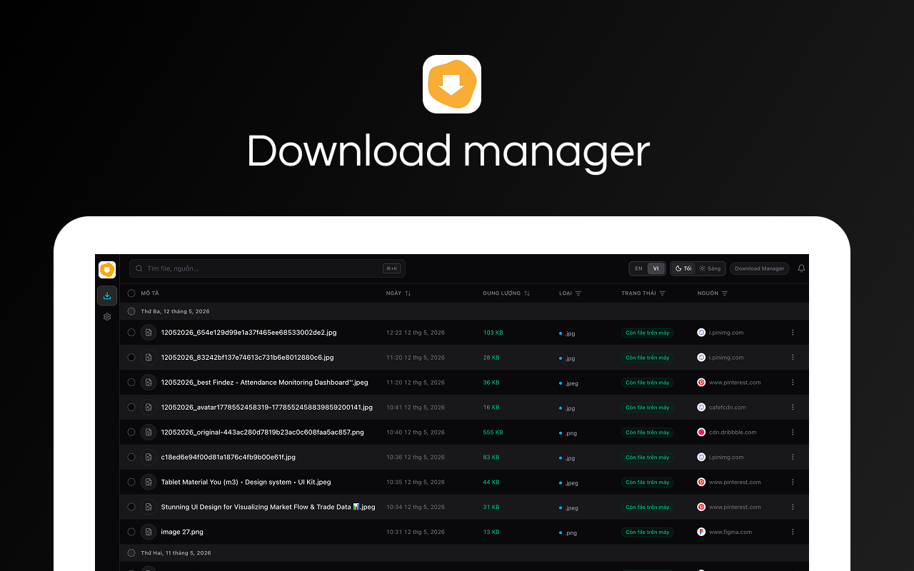
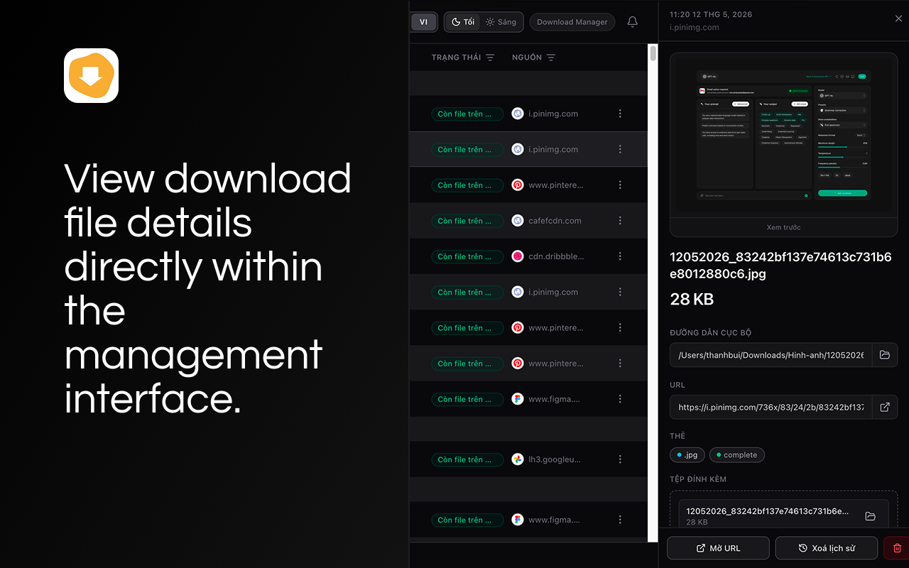
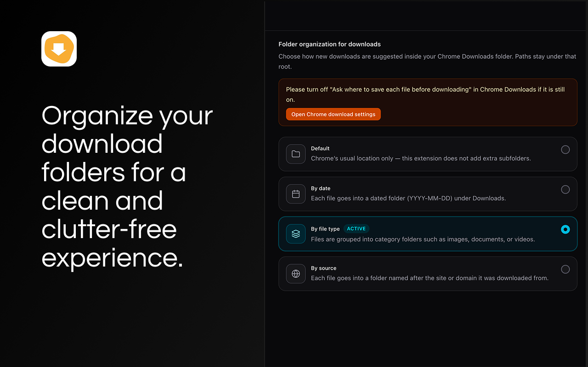

# Download Manager

A polished Chrome / Edge / Brave extension (Manifest V3) that **replaces the default `chrome://downloads` page** with a modern, dark, keyboard-friendly UI — and adds the missing power-features Chrome never shipped: smart per-file folder routing, automatic date prefixes, and right-click image saving that even works on hot-link–protected sites.

> Repository: <https://github.com/buigiathanh/extension-download-manager>

---

## Table of contents

- [For users](#for-users)
  - [What you get](#what-you-get)
  - [Screenshots](#screenshots)
  - [Install from source (no Chrome Web Store yet)](#install-from-source-no-chrome-web-store-yet)
  - [How to use it](#how-to-use-it)
  - [Filename & folder rules](#filename--folder-rules)
  - [FAQ / known limits](#faq--known-limits)
- [For developers](#for-developers)
  - [Tech stack](#tech-stack)
  - [Prerequisites](#prerequisites)
  - [Getting started](#getting-started)
  - [npm scripts](#npm-scripts)
  - [Project layout](#project-layout)
  - [How the source code is organised](#how-the-source-code-is-organised)
  - [Runtime architecture](#runtime-architecture)
  - [Conventions](#conventions)
  - [Common development tasks](#common-development-tasks)
  - [Permissions reference](#permissions-reference)
- [Contributing](#contributing)
- [License](#license)

---

## For users

### What you get

- 🗂 **A dark, modern downloads page** that opens whenever you click the extension icon — or whenever Chrome would have shown you `chrome://downloads`. Existing keyboard / context-menu habits keep working.
- 📅 **Automatic `DDMMYYYY_` prefix** in every saved filename. `photo.png` saved on 12 May 2026 becomes `12052026_photo.png`. Sorting by name is now sorting by day, for free.
- 📁 **One-click folder organisation**. In *Settings* you can pick:
  - **Default** — leave Chrome alone.
  - **By date** — group into `YYYY-MM-DD/`.
  - **By type** — group into friendly buckets (Images, Videos, Documents, Source code, Software, Other).
  - **By source** — group by the hostname the file came from.
- 🖼 **Right-click → "Download Image (Download manager)"**. Works on most sites with anti-hotlink protection (Instagram, X/Twitter CDN, Pinterest, blogs that block referer-less requests) because the extension transparently re-fetches the image from inside the page's own context.
- 🔍 **List view with filtering, sorting, grouping by day** and a detail panel for each download.
- 🐙 **Open-source by design**. There's a GitHub button on the side rail that takes you straight to the source code.

### Screenshots

Below are UI captures from the extension (dark theme; the in-app language can be **English** or **Vietnamese**).

**Overview** — main download list with the side rail (files / settings, GitHub, account), search, language & theme toggles, and grouped rows.

<p align="center">
  
</p>

**Download table** — columns for description, date, size, type, status, and source; files grouped by day with sortable headers.

<p align="center">
  
</p>

**File detail panel** — select a row to open an inline panel with preview (when available), local path, URL, tags, and quick actions.

<p align="center">
  
</p>

**Settings — folder organization** — choose default, by date, by file type, or by source; paths stay under your Chrome Downloads folder.

<p align="center">
  
</p>

### Install from source (no Chrome Web Store yet)

1. Download / clone this repo.
2. Build it once (see [Getting started](#getting-started)) — this produces a `dist/` folder.
3. Open `chrome://extensions` in Chrome (or Edge → `edge://extensions`, Brave → `brave://extensions`, …).
4. Toggle **Developer mode** on (top-right).
5. Click **Load unpacked** and pick the `dist/` folder.
6. Pin the **Download Manager** icon to your toolbar so you can find it later.

> When you update the code, run the build again and click the **Reload** (↻) button on the extension card. If you're running `npm run dev`, Chrome reloads the extension automatically.

### How to use it

| Action | How |
|---|---|
| Open the manager UI | Click the extension icon on the toolbar, **or** open `chrome://downloads` (it auto-redirects) |
| Browse downloads | The **Quản lý file** tab in the side rail |
| Change folder routing | The **Cài đặt** (Settings) tab in the side rail |
| Open the GitHub repo | The GitHub icon at the bottom of the side rail |
| Download a protected image | Right-click on the image → **Download Image (Download manager)** |

### Filename & folder rules

The extension hooks `chrome.downloads.onDeterminingFilename`, so it can rewrite the file path *before* Chrome decides where to put the bytes.

- The base filename is always prefixed with the current date as `DDMMYYYY_`.
  - The prefix is **idempotent** — re-suggesting the same item never produces `12052026_12052026_…`.
- The folder is computed from the active organize mode and is always **relative to your Chrome Downloads folder** (Chrome doesn't allow extensions to escape that root). Examples:

| Mode | Result for `photo.png` from `example.com` on 12 May 2026 |
|---|---|
| `default` | `12052026_photo.png` |
| `by-date` | `2026-05-12/12052026_photo.png` |
| `by-type` | `Hinh-anh/12052026_photo.png` |
| `by-source` | `example.com/12052026_photo.png` |

Folder names use ASCII-only characters (`Hinh-anh`, `Tai-lieu`, `Ma-nguon`, `Phan-mem`, `Khac`, …) to stay safe across Windows / macOS / Linux file systems.

### FAQ / known limits

- **Can it change my Downloads root?** No. Chrome's API only allows paths *relative to* the configured Downloads folder. Change the root in `chrome://settings/downloads`.
- **The "Ask where to save each file" dialog still appears.** That's a Chrome-level option. The extension's suggested name/folder will still be the default in the dialog.
- **Some images won't download.** The extension first tries the direct downloads API. If that fails (CORS / 403 from anti-hotlink) it falls back to fetching the image *from the page's own context*, which carries the correct `Referer` and cookies. If both fail, the image probably needs auth that the page itself doesn't have either.
- **It cannot set `Referer` or `Cookie` headers on `chrome.downloads.download`.** Those are forbidden headers in the Fetch spec; the page-context fallback is the supported way to deal with hot-link protection.

---

## For developers

### Tech stack

- **React 19** + **TypeScript 6** for the UI.
- **Vite 8** + **@crxjs/vite-plugin** for MV3 extension bundling (manifest + content-scripts + service-worker + HMR).
- **Tailwind CSS 4** (`@tailwindcss/vite`) for styling — utility classes only, no CSS modules.
- **lucide-react** for icons (the GitHub brand icon is inlined as raw SVG because Lucide dropped brand icons).
- **Chrome Extensions API (Manifest V3)** — see [`src/manifest.ts`](src/manifest.ts).

### Prerequisites

- **Node.js ≥ 20** (Vite 8 and `@crxjs/vite-plugin` require modern Node).
- **npm ≥ 10** (or pnpm / yarn — only `package-lock.json` is committed).
- A Chromium-based browser supporting Manifest V3.

### Getting started

```bash
# 1. Clone
git clone https://github.com/buigiathanh/extension-download-manager.git
cd extension-download-manager

# 2. Install
npm install

# 3a. One-off production build (recommended for "Load unpacked")
npm run build

# 3b. Or: rebuild on every change with HMR (recommended while developing)
npm run dev
```

Then load the `dist/` folder via **Load unpacked** in `chrome://extensions`.

### npm scripts

| Script | What it does |
|---|---|
| `npm run dev` | `vite` in watch mode. Re-emits `dist/` on every save and triggers Chrome to reload the extension via `@crxjs`. |
| `npm run build` | `tsc --noEmit && vite build` — strict type-check across the whole project, then a production bundle into `dist/`. |
| `npm run preview` | `vite preview` — only useful for previewing the SPA in a normal browser tab (not as an extension). |

### Project layout

```
.
├── public/
│   └── icons/                  # 16/32/48/128 PNGs referenced by manifest.icons + action.default_icon
├── logo.png                    # Original 128×128 source for the icons
├── src/
│   ├── manifest.ts             # Single source of truth for the MV3 manifest (typed via @crxjs)
│   ├── main.tsx                # React entrypoint mounted into index.html
│   ├── App.tsx                 # Top-level layout: LeftRail + (DownloadsPanel | SettingsPanel)
│   ├── background.ts           # Service worker: filename routing, chrome://downloads redirect, action click
│   ├── index.css               # Tailwind base + project-wide tweaks
│   ├── vite-env.d.ts
│   ├── components/             # All React UI components
│   │   ├── LeftRail.tsx
│   │   ├── DownloadsPanel.tsx
│   │   ├── DownloadDetailPanel.tsx
│   │   ├── SettingsPanel.tsx
│   │   ├── ThemeToggle.tsx
│   │   ├── ConfirmDialog.tsx
│   │   ├── CreateFolderDialog.tsx
│   │   ├── DownloadAskLocationDialog.tsx
│   │   └── CloudFoldersPanel.tsx           # legacy, not wired into routing
│   ├── context/
│   │   └── ThemeContext.tsx
│   └── lib/                    # Framework-agnostic helpers (pure functions + chrome.* wrappers)
│       ├── downloads.ts                    # baseName, extensionOf, sortDownloads, date prefix helpers, …
│       ├── downloadPathRouting.ts          # suggestedRelativePathForOrganizeMode, prefix helpers
│       ├── downloadImageContextMenu.ts     # right-click "Download Image" + page-context fallback
│       ├── folderOrganizeSettings.ts       # load / save organize mode via chrome.storage.local
│       ├── chromeDownloadAskLocationProbe.ts
│       ├── openChromeDownloadsSettings.ts
│       └── cloudFolders.ts                 # legacy local-only data
├── index.html
├── vite.config.ts
├── tsconfig.json
├── tsconfig.node.json
├── package.json
└── README.md
```

### How the source code is organised

The code is split into **three concentric layers**. Each layer only depends on the ones below it.

1. **`src/lib/*` — pure helpers and chrome.* wrappers.**
   - Everything that does *not* render is here: filename derivation, MIME / extension classification, sort comparators, storage I/O, the date prefix helper.
   - Functions are deliberately small and side-effect free where possible so they can be reused both in React components and in the background service worker.
   - Highlights:
     - `downloads.ts` — `baseName`, `extensionOf`, `dayKey`, `sortDownloads`, `formatDownloadBytes`, `downloadDatePrefixFromIso`, `applyDownloadDatePrefixToBaseName`, …
     - `downloadPathRouting.ts` — `suggestedRelativePathForOrganizeMode(mode, item)` and `suggestedFilenameWithDownloadTimePrefix(item)`. This is the single function the background worker calls.
     - `downloadImageContextMenu.ts` — registers the right-click menu, calls `chrome.downloads.download` first, and falls back to `chrome.scripting.executeScript` to fetch the image *inside* the page when the direct download fails.
     - `folderOrganizeSettings.ts` — `loadFolderOrganizeMode()` / `saveFolderOrganizeMode(mode)` backed by `chrome.storage.local`. `DownloadFolderOrganizeMode` is `"default" | "by-date" | "by-type" | "by-source"`.

2. **`src/components/*` — React components.**
   - Each panel is self-contained and reads/writes through the helpers in `lib/`.
   - Components never call `chrome.downloads.*` URL-routing logic directly — they go through the helpers, so the same logic stays consistent with the background worker.

3. **`src/App.tsx` + `src/background.ts` — composition roots.**
   - `App.tsx` glues `LeftRail`, `DownloadsPanel`, `DownloadDetailPanel`, and `SettingsPanel` together based on the active `NavKey`.
   - `background.ts` registers the service worker listeners and is the only place that calls `suggestedRelativePathForOrganizeMode` / `suggestedFilenameWithDownloadTimePrefix`.

### Runtime architecture

```
        ┌──────────────────────────────────────────────┐
        │  Chrome browser (user clicks "save")         │
        └───────────────┬──────────────────────────────┘
                        │ chrome.downloads.* event
                        ▼
        ┌──────────────────────────────────────────────┐
        │  src/background.ts (MV3 service worker)      │
        │                                              │
        │  • onDeterminingFilename → rewrite filename  │
        │     via downloadPathRouting.ts               │
        │  • action.onClicked  → open manager tab      │
        │  • tabs/webNavigation listeners              │
        │     redirect chrome://downloads to extension │
        │  • registers right-click "Download Image"    │
        └───────────────┬──────────────────────────────┘
                        │ chrome.storage.local (mode)
                        ▼
        ┌──────────────────────────────────────────────┐
        │  Extension page (index.html → React app)     │
        │                                              │
        │  src/App.tsx                                 │
        │   ├── LeftRail                               │
        │   ├── DownloadsPanel + DownloadDetailPanel   │
        │   └── SettingsPanel (writes organize mode)   │
        └──────────────────────────────────────────────┘
```

Key flows:

- **Filename routing**:
  1. Chrome fires `onDeterminingFilename(downloadItem, suggest)`.
  2. The worker loads the current organize mode (cached in memory, invalidated on `chrome.storage.onChanged`).
  3. It calls `suggestedRelativePathForOrganizeMode(mode, downloadItem)` for non-default modes, or `suggestedFilenameWithDownloadTimePrefix(downloadItem)` for the default mode.
  4. The worker calls `suggest({ filename, conflictAction: "uniquify" })`.

- **`chrome://downloads` redirect**: `chrome.tabs.onUpdated` + `chrome.webNavigation.onCommitted` listen for that URL and replace it with the extension's `index.html`.

- **Right-click image download**:
  1. `contextMenus.onClicked` fires for `dm_download_image_via_manager`.
  2. The worker tries `chrome.downloads.download({ url })` directly (fast, streaming, low RAM).
  3. If that fails, it injects a tiny `fetch + FileReader.readAsDataURL` into the page via `chrome.scripting.executeScript`, then calls `chrome.downloads.download({ url: dataUrl })`. This way the browser uses the page's own `Referer` and cookies — bypassing anti-hotlink protection.

### Conventions

- **Strict TypeScript** — `tsc --noEmit` runs as part of `npm run build`. No `any` is checked in.
- **No CSS files per component** — Tailwind utility classes only, with `dark:` variants for dark mode.
- **Comments are in Vietnamese** in some legacy files (this repo started in Vietnamese). When extending the code, write new comments in English; do not narrate trivial behaviour — only explain *why*, trade-offs, or non-obvious browser quirks.
- **Helpers are pure where possible**, async wrappers around `chrome.*` live next to them and never embed UI logic.
- **Forbidden headers are forbidden**. Never try to set `Referer`, `Cookie`, `User-Agent`, … on `chrome.downloads.download` — the API will reject the request with `"Unsafe request header name"`. Use the page-context fetch fallback instead.

### Common development tasks

- **Add a new organize mode**
  1. Extend the union in `src/lib/folderOrganizeSettings.ts` (`DownloadFolderOrganizeMode`).
  2. Implement the folder/filename logic in `src/lib/downloadPathRouting.ts`.
  3. Add the radio option to `src/components/SettingsPanel.tsx`.
  4. No background worker change needed — it already routes through `suggestedRelativePathForOrganizeMode`.

- **Change the filename prefix format**
  - The single source of truth is `downloadDatePrefixFromIso` in `src/lib/downloads.ts`. Update the formatting there; both the default mode (`suggestedFilenameWithDownloadTimePrefix`) and the organized modes (`suggestedRelativePathForOrganizeMode`) use it.

- **Replace the toolbar icon**
  - Put a new `logo.png` (≥ 128×128) at the repo root.
  - Regenerate the four sizes into `public/icons/` (the repo's `icon-*.png` files), e.g. with `sips` on macOS or any image editor.
  - `manifest.icons` and `action.default_icon` already reference them by relative path; no manifest change needed.

- **Add a new permission**
  - Add it to the `permissions` array in `src/manifest.ts`. `@crxjs` will re-emit `dist/manifest.json` automatically.
  - Make sure to document *why* it is required in this README (Permissions table below).

- **Add a side-rail entry**
  - Update `NavKey` and the `modules` array in `src/components/LeftRail.tsx`.
  - Wire it up in the `nav === ?` branch of `src/App.tsx`.

### Permissions reference

| Manifest key | Purpose |
|---|---|
| `permissions.downloads` | Read download items, suggest filenames in `onDeterminingFilename`, trigger downloads via `chrome.downloads.download`. |
| `permissions.contextMenus` | Register the right-click **"Download Image (Download manager)"** entry. |
| `permissions.scripting` | Inject the page-context `fetch + FileReader` snippet that re-downloads hot-link–protected images. |
| `permissions.tabs` | Open the manager tab from the toolbar action and from the side-rail GitHub button. |
| `permissions.webNavigation` | Catch top-level navigations to `chrome://downloads` and redirect them to the extension. |
| `permissions.identity`, `permissions.identity.email` | Show the signed-in user's name/initial on the side rail. |
| `permissions.storage` | Persist the active organize mode in `chrome.storage.local`. |
| `host_permissions: ["<all_urls>"]` | Required for the `scripting` fallback to work on any site the user is visiting. |

---

## Contributing

1. Fork the repo and create a feature branch off `main`.
2. `npm install && npm run dev`.
3. Make changes, keep `tsc --noEmit` clean (it runs as part of `npm run build`).
4. Open a Pull Request against <https://github.com/buigiathanh/extension-download-manager>.

When in doubt, prefer:

- Small, focused PRs over big sweeping refactors.
- Helpers in `src/lib/*` over inline logic in components.
- Explaining *why* in comments, never *what*.

---

## License

ISC — see `package.json`.
